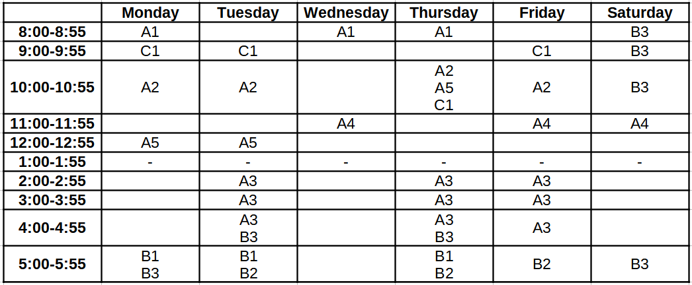

# Schedule Selector

This is a simple and crude implementation of a filter to construct a personalized schedule for the semester based on the courses you are taking. 

This project was the perfect excuse to use my newfound knowledge on frontend web design (implementing this in a collab notebook using python ofcourse  would've been far far cleaner). 

As a result, much of the code might be spaghetti, and older browser version compatiblity was not taken into consideration at all. If anyone wants to extend the features, feel free to do so!

## Parsing the timetable
The deanacad office provides the schedule to us in PDF format, so there are some intermediate conversions required to feed the data to the applet. This process is now automated using the [tabula software](https://github.com/tabulapdf/tabula-java) which requires java to be installed, and a python3 script.

**Note:** It turns out that the deanacad office uses different formats every semester which complicates the parsing procedure. As of now, it is being maintained by tweaking the tabula commands and manually cleaning the data, however, the way to go forward is to request a standard CSV format from the deanacad directly. An example of the parsing is given below, in case anyone is forced to manually perform this process.

### Parsing format
The table is hardcoded to have 6 columns (Mon-Sat) and 9 rows (1hr slots within 8am - 6pm) and the data must be fed in CSV format, with within-cell-entries seperated by "|". Any empty cells in the 9x6 data matrix must be explicitly inserted using "," wherever required. For example, suppose Ai, Bi, Ci are some courses in this timetable:



This is the kind of data that must finally be in the ```index.html``` file:
```
A1,,A1,A1,,B3
C1,C1,,,C1,B3
A2,A2,,A2|A5|C1,A2,B3
,,A4,,A4,A4
A5,A5,,,,
,,,,,
,A3,,A3,A3,
,A3,,A3,A3,
,A3|B3,,A3|B3,A3,
B1|B3,B1|B2,,B1|B2,B2,B3
```

**Note:** There must always be 9x6 cells in the final data provided to ```index.html```.

## Updating the timetable

On a linux machine

0. Install java jdk11, python3
1. cd into repo
2. run `chmod +x ./makett`
3. Download to newest timetable to `./tt.pdf`
4. run `./makett`

The script downloads the libraries if necessary and updates index.html

## Change the frontend

Edit `index-template.html` for any changes. All changes to index.html are lost on timetable update.
Make sure that the `{{ datadiv }}` line is unaltered somewhere within the body div as the script parses this to create the timetable.

## To Do
- [x] Color picker to change the base website color.
- [x] Export options
- [x] Automate pre-processing of the table
